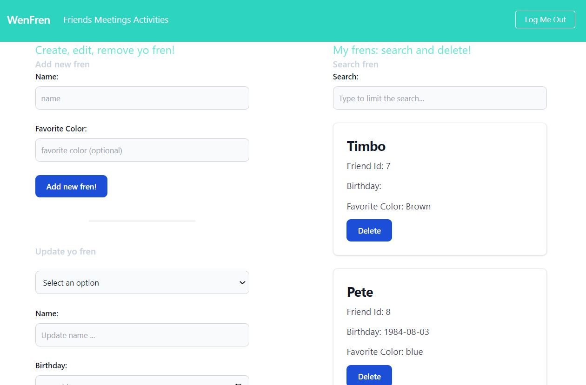
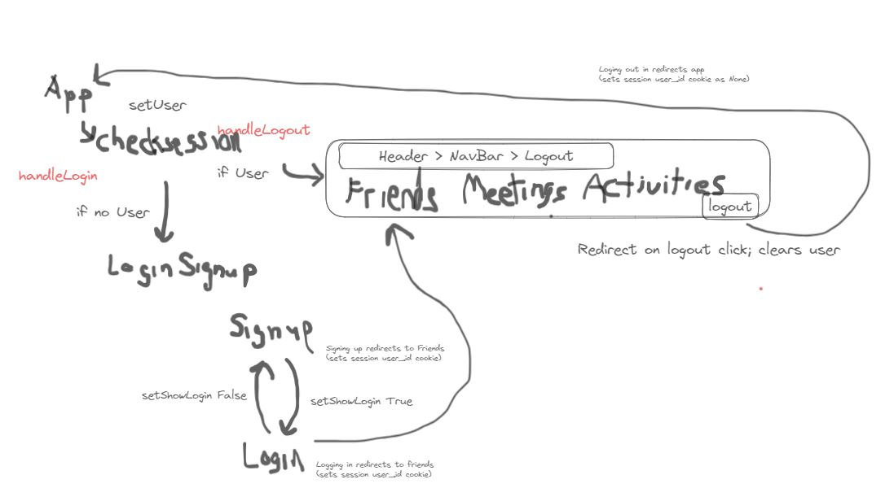
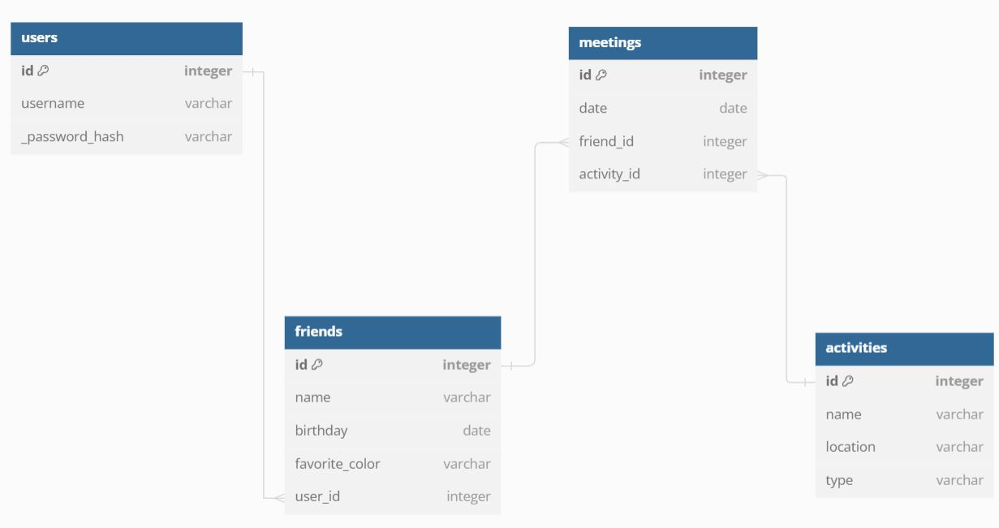

# README: Software Engineering Project 4 Full-Stack Application (REACT/Flask)

## Overview: 
- Flask SQLAlchemy API (python) backend with a React frontend.
- Four models on the backend, that including
    - one-to-many relationships.
    - reciprocal many-to-many relationship. (with user submitable attribute)
- Full CRUD on at least 1 model, following REST conventions.
- Create and read actions for EACH resource.
- Forms and validation through Formik on all input (use of Yup)
- Multiple client-side routes using React Router (with NavBar).
- Connect the client and server using fetch()
- User signup, authentication and authorizations.
- Hashed assword storage, encryption, salting.

# User Stories
- As a user, I can:
    - log in, log out
    - View all my friends (add, delete, modify, add informaation)
    - View all my meetings with friends (add, delete)
    - View all my activities (add)

# Model and Relationships
- User
- Friend
- Meeting
- Activity

# App Flow

# Database Architecture

# Setup

mkdir preject

## Client setup
- At root:
- npx create-react-app client
- npm install react-router-dom@6

## Server setup

- At root
- pipenv install Flask gunicorn psycopg2-binary Flask-SQLAlchemy Flask-Migrate SQLAlchemy-Serializer Flask-RESTful faker Flask-Bcrypt python-dotenv
- creates Pipfile and Piplock
- pipenv requirements > requirements.txt

## Initial Launch Commands 
- Connect to GitHub repository

## Activating Pipenv (python code)
- pipenv shell

## Local running
### Starting the NPM server for the app to run on
- npm start --prefix client

### Starting the backend server
- python server/app.py
- python server/seed.py (as applicable)
## Connect to git

## Set Proxy
Set Proxy in client/package.json to   "proxy": "http://localhost:5555",

# Useful Resources
- Routes v6 https://github.com/learn-co-curriculum/react-hooks-react-router-code-along-v6/blob/master/src/components/UserCard.js
- Tailwind CSS https://flowbite.com/docs/components/card/
- https://formik.org/docs/overview
- Useful Tailwind CSS https://flowbite.com/docs/components/forms/
- https://tailwindcss.com/
- https://dev.to/przpiw/build-elegant-forms-reactformik-tailwind-54d8